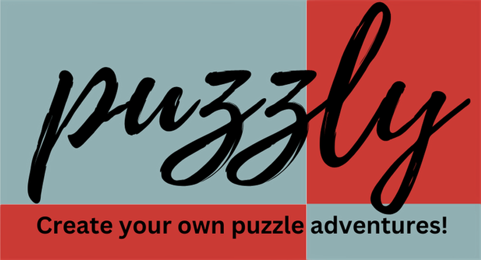

# Puzzly

<p align="center">
  
</p>

Puzzly is a game that turns any image into a puzzle. The first idea for this game came to life when I was playing a puzzle minigame from **[Call of Duty: Mobile](https://www.callofduty.com/mobile)**. After a few days of thinking about how to build this app, I decided to create it using **[React](https://react.dev)** as it was going to be just a simple web app. I also designed the sound effects and created them using GarageBand (_you know how much I love music!_).

## How to Play

<p align="center">
  
  
</p>

Puzzly is a simple game. Just **upload any picture**, **select a difficulty level**, and **start solving the puzzle**! There are three difficulty levels: **easy**, **medium** and **hard**. The difference between these levels is the number of pieces. The harder the level, the more puzzle pieces you need to assemble. The number of pieces is calculated roughly using the formula:

```bash
Math.round(Math.sqrt(imageAspectRatio * n))
```

where **n** represents the base number of pieces for each difficulty: 50 for easy, 100 for medium, and 200 for hard.

## Getting Started

### 1. Clone the Repository

Clone the repository to your local machine:

```bash
git clone https://github.com/williamo1099/Puzzly
cd Puzzly
```

### 2. Install Dependencies

Install the required frontend dependencies:

```bash
npm install
```

### 3. Run the Development Server

Start the development server locally:

```bash
npm run dev
```

### 4. Build for Production

To generate a production-ready build, run:

```bash
npm run build
npm start
```

## License

Distributed under the MIT Lincese. See `LICENSE` for more information.
